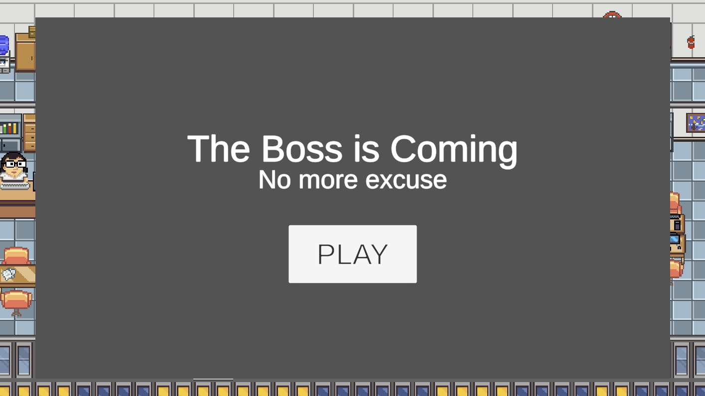
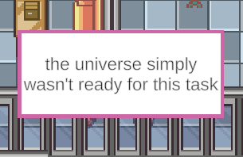
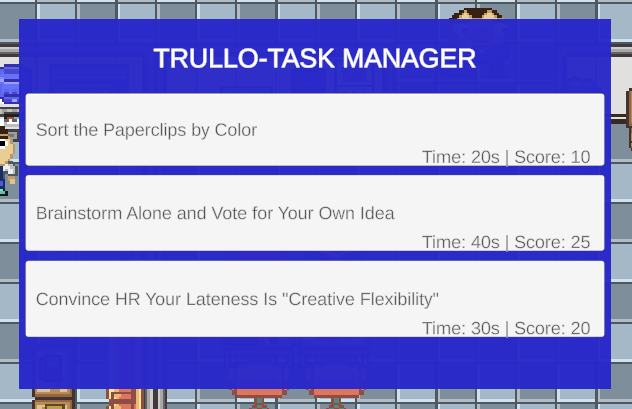

# The Boss Is Coming

A GMTK Game Jam 2026 entry — theme: **Count Down**


You're a model employee. Or at least, that's what your boss should think. In
reality you've done absolutely nothing all day, and now he's heading straight
for your desk to ask why. All you have is a handful of excuses and a deck
that keeps getting thinner — improvise, invent, and above all: don't repeat
yourself, or he won't buy it twice.

---

## How to play

When the boss reaches your desk, he asks a question with a blank to fill in —
something like *"I haven't finished the report because ___"*. Pick an excuse
card from your hand to complete the sentence: the more credible the excuse,
the more extra time you earn before he comes asking again.

Each excuse belongs to a category (**Technology, Health, Family, Force
Majeure, Absurd**), shown by the color of the card's border. Careful: using
the same category twice in a row halves its value — he starts getting
suspicious. Mix up your categories to stay believable for as long as
possible.

Rack up enough time to clear a ridiculous task (like *"Sort the Paperclips by
Color"*), then pick your next one from 3 options — riskier tasks are worth
more points. The game ends when you run out of excuses; that moment is
inevitable, the only question is how long you can stall it.

### Controls

- **Left click**: play a card
- **Right click**: discard a card
- **"Cook up a new excuse" button**: redraw a new card (costs time)

---

## Screenshots

| Main menu | Picking an excuse | Task choice (Break) |
|---|---|---|
|  |  |  |

---

## Play it

🔗 itch.io page: *add the link here*

---

## Tech stack

- **Engine:** Unity 6, Universal 2D template (URP + 2D Renderer)
- **Platform:** WebGL
- **Input:** legacy Input Manager (not the new Input System)
- **UI:** UGUI + TextMeshPro
- **Namespace:** `GmtkCountdown`

## Project structure

```
Assets/
  _Project/
    Scripts/
      Core/       — GameManager, DeckManager, CountdownController,
                     TaskManager, BossMover, GameplayController, Hand
      Data/       — ScriptableObject definitions (FragmentData, PromptData,
                     TaskData, BossLineData, FragmentCategory)
      UI/         — CardSlotUI, RedrawButtonUI, TaskChoiceButtonUI,
                     GameOverPanelUI, MainMenuUI, BossSpeechUI
      Editor/     — content/task bulk creators, shared bulk-creator utility
  Scenes/
    scn_office.unity   — the game scene
```

### Core loop, briefly

`GameManager` drives a small state machine (`Countdown → Interruption →
TaskCompleted → Break`, with `GameOver` reachable from either Countdown's end
or after playing a card). `GameplayController` owns input, UI visibility, and
orchestration; the hand of cards itself lives in a plain C# `Hand` class with
no Unity lifecycle. Content — excuse prompts, excuse fragments, tasks, boss
lines — is authored as `ScriptableObject` data, generated in bulk by editor
tools under `Tools/GMTK Countdown/*`.

---

## Development status

Submitted to GMTK Game Jam 2026 (tag `jam-submission-v1.0`). Since then the
codebase has been through a full post-jam refactoring pass: dead code
removal, a unified time/credibility vocabulary, the original monolithic
debug controller split into smaller pieces (with the hand of cards extracted
into its own class), a state-machine event-ordering bug fixed, and the two
separate Game Over conditions consolidated into one (with a small, explicit
gameplay fix: running out of cards used to end the game even with playable
cards still in hand — that's been corrected).

Gameplay behavior is otherwise unchanged from the jam build. See
`REFACTORING.md` (local, not tracked in git) for the full step-by-step log.

### Known gaps (not yet in the build)

- 🔇 No audio (ambient office sound, footsteps, card-selection feedback)
- ⏸️ No pause menu
- 📖 No in-game tutorial/onboarding
- ⚖️ Balance (time caps, redraw cost, task thresholds) has only been tuned
  by the solo dev under jam time pressure — no external playtesting yet
- 💻 No standalone build (Windows/Mac) — WebGL only

### Roadmap

Audio, UI/UX polish, pause menu, external-playtest balancing, and a
standalone build for portfolio purposes are next. A visual restyle
(evaluating a 2D-HD approach, in the vein of Octopath Traveler or the recent
Pokémon Red/Blue mods) is also under consideration, pending a feasibility
pass, as an experiment separate from the current Pixel Office look.

---

## Credits

- **Design & development:** Andrea Alicino
- **Art:** "Pixel Office 32x32" by Masalimov Ilnur
- No AI-generated assets were used, per the jam's rules — all art and audio
  are CC0/free assets with credit, or original work.

---

## License

This project's original code is licensed under the [MIT License](LICENSE).
Third-party assets (see Credits above) remain under their own respective
licenses and are not covered by it.